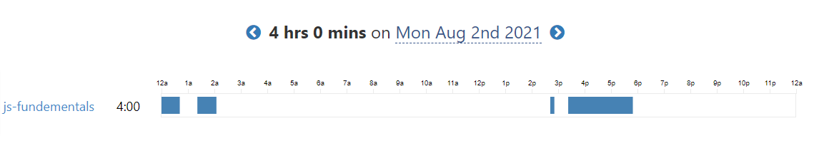
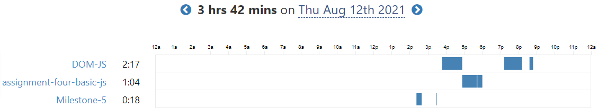

# 100 Days Of Code - Log

### Day 0: July 30, 2021

**Today's Progress**: Learn the basics _AGAIN_

**Thoughts**: Though I know basic C programming out of my curiousity, JavaScript is more liberal than this. In short, I love the syntax!

---

### Day 1: July 31, 2021

**Today's Progress**: Learn about variables declaration, data types, parseInt(), parseFloat, toFixed() method.

**Thoughts**: Wonder how easy to implement and write any pre-written method to a program. Look forward to learn more!!

---

### Day 2: August 1, 2021

**Today's Progress**:

1. Learn about array (declaration, indexOf() method index searching, charAt() push(), pop(), shift(), unshift(), splice() method).
2. Learn about conditionals (if/else statements, switch statements)
3. Basic construction of a function.

### Screenshot

_screenshot generated from [Waka Time](https://wakatime.com/). One of the best productivity tools for developers. Check this out._

**Thoughts**: When I practice the array's indexOf() method, I get confused with search by the index and by the array element. MDN Documentation helped me a lot with that topic. I find the function very interesting though.

---

### Day 3: August 2, 2021

**Today's Progress**:

1. Learn more about functions and arrays.
2. Learn about loops (while, do..while, for).
3. Solved around 15 beginner javascript problem question.

### Screenshot

_screenshot generated from [Waka Time](https://wakatime.com/). One of the best productivity tools for developers. Check this out._

**Thoughts**:
Today I solve around 15 problem questions on hackernoon. Really enjoyed these exercises. Look forward to solving more and more.

---

### Day 4: August 3, 2021

**Today's Progress**:

1. Explore objects and more functions
2. Learn how to use prompt method (user input) in node CLI

### Screenshot

_screenshot generated from [Waka Time](https://wakatime.com/). One of the best productivity tools for developers. Check this out._

**Thoughts**:
Today I discover an amazing thing which is how to take user input from node command line. Though the process is not as easy as normal browser prompt, but I enjoy this.

---

### Day 5: August 4, 2021

**Today's Progress**

1. Learn about the basics of recursive function
2. Revise everything I learn from day zero.

### Screenshot

_screenshot generated from [Waka Time](https://wakatime.com/). One of the best productivity tools for developers. Check this out._

**Thoughts**:
I find the recursion on JavaScript is a bit weird. Solved a program that finds the nth Fibonacci number using recursive function. Look forward to solving more problem questions.

---

### Day 6: August 5, 2021

**Today's Progress**

1. Learn nothing new today.
2. Have practised [Hackernoon's](https://hackernoon.com/javascript-practical-coding-challenges-for-beginners-4bq3ugr) problem questions again.

### Screenshot

_screenshot generated from [Waka Time](https://wakatime.com/). One of the best productivity tools for developers. Check this out._

**Thoughts**:
Following yesterday, today was the last revision day before starting some intermediate concepts in JavaScript. Best of luck myself.

---

### Day 7: August 6, 2021

**Today's Progress**

1. Learn the application of various Math functions, ie, Math.abs(), min(), max(), round(), ceil(), floor(), random()
2. Learn how to swap to swap variable and use of destructuring with an array.
3. Learn how to use recursion to find nth Fibonacci in a series.

### Screenshot

_screenshot generated from [Waka Time](https://wakatime.com/). One of the best productivity tools for developers. Check this out._

**Thoughts**:
I've practised more problem questions by applying what I learned today. Though, I struggled a bit in the recursion method and finding the nth Fibonacci using that method. Hope I will overcome my confusion in the following days.

---

### Day 8: August 7, 2021

**Today's Progress**

1. Learn how to use for...of loops.
2. Solved a bunch of code challenges relating to array, loops and conditions.

### Screenshot

_screenshot generated from [Waka Time](https://wakatime.com/). One of the best productivity tools for developers. Check this out._

**Thoughts**:
Today was great for me because I learned a lot of new things while solving the coding challenges. Mainly, I was able to remove my confusion in the arrays and loops, and I'm looking forward to practising the next day and revising the previous learnings once again.

---

### Day 9: August 8, 2021

**Today's Progress**

1. Today I have practised what I have learned so far and cleared up the topic that is confusing to me.

### Screenshot

_screenshot generated from [Waka Time](https://wakatime.com/). One of the best productivity tools for developers. Check this out._

**Thoughts**:
I don't know how much time should I practice coding. But I think today is enough and will look forward to the next day.

---

### Day 10: August 9, 2021

**Today's Progress**

1. Today, I did not code for a long time and want to take a pause for various reasons, but I shouldn't stop practising. Nothing new today.

### Screenshot

_screenshot generated from [Waka Time](https://wakatime.com/). One of the best productivity tools for developers. Check this out._

**Thoughts**:
The day was not great.

---

### Day 11: August 10, 2021

**Today's Progress**

1. Today, I solved 10 new problems in JavaScript

### Screenshot

_screenshot generated from [Waka Time](https://wakatime.com/). One of the best productivity tools for developers. Check this out._

**Thoughts**:
I should code more and more and practice more. But...

---

### Day 12: August 11, 2021

**Today's Progress**

1. Today I revised all the basics and techniques that I have learned so far before starting to understand the Document Object Model.

### Screenshot

**screenshot generated from [Waka Time](https://wakatime.com/). One of the best productivity tools for developers. Check this out.**

**Thoughts**:
Last two days, I could not code that much I want every day. But today, I code a significant amount of time. Hope that tomorrow will be great for me.

---

### Day 13: August 12, 2021

**Today's Progress**

1. Learned about the basics of how DOM works.
   Learned how to use getElementById(), getElementsByClassName(), getElementByTagName(), querySelector(), querySelectorAll().
2. Learned the basics of NodeList, HTML collection, setAttribute(), parentNode, childnodes.
3. How to add styles in a particular tag, class or id.
4. How to create an element, how to append an element, how to add class using classList.add().
5. innerHTML and innerText

### Screenshot

_screenshot generated from [Waka Time](https://wakatime.com/). One of the best productivity tools for developers. Check this out._

**Thoughts**:
Today I learned many new things about the DOM and the very basics. I played around with some dom function and explore a whole new area. I enjoyed the day.

---

### Day 14: August 13, 2021

**Today's Progress**

1. Today I learned the basics of DOM events, event listeners and event bubble.

### Screenshot

_screenshot generated from [Waka Time](https://wakatime.com/). One of the best productivity tools for developers. Check this out._

**Thoughts**:
The Document Object Model is a vast topic. I feel lost and overwhelming sometimes. I know I learned the basics fundamentals, but I should brush up on all the things again tomorrow.

---

### Day 15: August 14, 2021

**Today's Progress**

1. Today, I practiced everything I learned about the DOM and added some javascript events to an existing site that I created earlier.

### Screenshot

_screenshot generated from [Waka Time](https://wakatime.com/). One of the best productivity tools for developers. Check this out._

**Thoughts**:
Today besides the DOM, I have also completed a challenge from Frontend Mentor. It helps me to recall my HTML and CSS skills well. Now, I look forward to learning about some advanced events in DOM.

---

### Day 16: August 15, 2021

**Today's Progress**

1. Today, I learned how to get user input from an HTML form and calculate it by creating a simple banking website.
2. Then, I made a simple BMI calculator using vanilla JS and Tailwind CSS.

### Project Shot

### Screenshot

_screenshot generated from [Waka Time](https://wakatime.com/). One of the best productivity tools for developers. Check this out._

**Thoughts**:
Today was great for me because I learned lots of new things and techniques. Slowly, my confusion is fading away. Look forward to making something more dynamic with the DOM.

---

### Day 17: August 16, 2021

**Today's Progress**

1. Today, I've added some advanced functionality in my previous projects, such as error handling, input validation etc.
2. I also try to improve the functionality of the BMI calculator that I created yesterday.

_screenshot generated from [Code Time](https://www.software.com/). Although, I have been using **Waka Time** for a great amount time but it cannot generate more than a week's report in its free version. Then today, I tried out **Code Time** and honestly I'm impressed._

**Thoughts:**
Today, I learn many new things about input validation, function management, and the importance of creating a super cool function that prevents "DRY". I had a great day.
