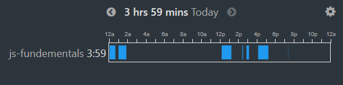

# 100 Days Of Code - Log

### Day 0: July 30, 2021

**Today's Progress**: Learn the basics _AGAIN_

**Thoughts**: Though I know basic C programming out of my curiousity, JavaScript is more liberal than this. In short, I love the syntax!

---

### Day 1: July 31, 2021

**Today's Progress**: Learn about variables declaration, data types, parseInt(), parseFloat, toFixed() method.

**Thoughts**: Wonder how easy to implement and write any pre-written method to a program. Look forward to learn more!!

---

### Day 2: August 1, 2021

**Today's Progress**:

1. Learn about array (declaration, indexOf() method index searching, charAt() push(), pop(), shift(), unshift(), splice() method).
2. Learn about conditionals (if/else statements, switch statements)
3. Basic construction of a function.

### Screenshot

_screenshot generated from [Waka Time](https://wakatime.com/). One of the best productivity tools for developers. Check this out._

**Thoughts**: When I practice the array's indexOf() method, I get confused with search by the index and by the array element. MDN Documentation helped me a lot with that topic. I find the function very interesting though.

---

### Day 3: August 2, 2021

**Today's Progress**:

1. Learn more about functions and arrays.
2. Learn about loops (while, do..while, for).
3. Solved around 15 beginner javascript problem question.

### Screenshot

_screenshot generated from [Waka Time](https://wakatime.com/). One of the best productivity tools for developers. Check this out._

**Thoughts**:
Today I solve around 15 problem questions on hackernoon. Really enjoyed these exercises. Look forward to solving more and more.

---

### Day 4: August 3, 2021

**Today's Progress**:

1. Explore objects and more functions
2. Learn how to use prompt method (user input) in node CLI

### Screenshot

_screenshot generated from [Waka Time](https://wakatime.com/). One of the best productivity tools for developers. Check this out._

**Thoughts**:
Today I discover an amazing thing which is how to take user input from node command line. Though the process is not as easy as normal browser prompt, but I enjoy this.

---

### Day 5: August 4, 2021

**Today's Progress**

1. Learn about the basics of recursive function
2. Revise everything I learn from day zero.

### Screenshot

_screenshot generated from [Waka Time](https://wakatime.com/). One of the best productivity tools for developers. Check this out._

**Thoughts**:
I find the recursion on JavaScript is a bit weird. Solved a program that finds the nth Fibonacci number using recursive function. Look forward to solving more problem questions.

---

### Day 6: August 5, 2021

**Today's Progress**

1. Learn nothing new today.
2. Have practised [Hackernoon's](https://hackernoon.com/javascript-practical-coding-challenges-for-beginners-4bq3ugr) problem questions again.

### Screenshot

_screenshot generated from [Waka Time](https://wakatime.com/). One of the best productivity tools for developers. Check this out._

**Thoughts**:
Following yesterday, today was the last revision day before starting some intermediate concepts in JavaScript. Best of luck myself.

---

### Day 7: August 6, 2021

**Today's Progress**

1. Learn the application of various Math functions, ie, Math.abs(), min(), max(), round(), ceil(), floor(), random()
2. Learn how to swap to swap variable and use of destructuring with an array.
3. Learn how to use recursion to find nth Fibonacci in a series.

### Screenshot

_screenshot generated from [Waka Time](https://wakatime.com/). One of the best productivity tools for developers. Check this out._

**Thoughts**:
I've practised more problem questions by applying what I learned today. Though, I struggled a bit in the recursion method and finding the nth Fibonacci using that method. Hope I will overcome my confusion in the following days.

---

### Day 8: August 7, 2021

**Today's Progress**

1. Learn how to use for...of loops.
2. Solved a bunch of code challenges relating to array, loops and conditions.

### Screenshot

_screenshot generated from [Waka Time](https://wakatime.com/). One of the best productivity tools for developers. Check this out._

**Thoughts**:
Today was great for me because I learned a lot of new things while solving the coding challenges. Mainly, I was able to remove my confusion in the arrays and loops, and I'm looking forward to practising the next day and revising the previous learnings once again.

---

### Day 9: August 8, 2021

**Today's Progress**

1. Today I have practised what I have learned so far and cleared up the topic that is confusing to me.

### Screenshot

_screenshot generated from [Waka Time](https://wakatime.com/). One of the best productivity tools for developers. Check this out._

**Thoughts**:
I don't know how much time should I practice coding. But I think today is enough and will look forward to the next day.

---

### Day 10: August 9, 2021

**Today's Progress**

1. Today, I did not code for a long time and want to take a pause for various reasons, but I shouldn't stop practising. Nothing new today.

### Screenshot

_screenshot generated from [Waka Time](https://wakatime.com/). One of the best productivity tools for developers. Check this out._

**Thoughts**:
The day was not great.

---

### Day 11: August 10, 2021

**Today's Progress**

1. Today, I solved 10 new problems in JavaScript

### Screenshot

_screenshot generated from [Waka Time](https://wakatime.com/). One of the best productivity tools for developers. Check this out._

**Thoughts**:
I should code more and more and practice more. But...

---

### Day 12: August 11, 2021

**Today's Progress**

1. Today I revised all the basics and techniques that I have learned so far before starting to understand the Document Object Model.

### Screenshot

**screenshot generated from [Waka Time](https://wakatime.com/). One of the best productivity tools for developers. Check this out.**

**Thoughts**:
Last two days, I could not code that much I want every day. But today, I code a significant amount of time. Hope that tomorrow will be great for me.

---

### Day 13: August 12, 2021

**Today's Progress**

1. Learned about the basics of how DOM works.
   Learned how to use getElementById(), getElementsByClassName(), getElementByTagName(), querySelector(), querySelectorAll().
2. Learned the basics of NodeList, HTML collection, setAttribute(), parentNode, childnodes.
3. How to add styles in a particular tag, class or id.
4. How to create an element, how to append an element, how to add class using classList.add().
5. innerHTML and innerText

### Screenshot

_screenshot generated from [Waka Time](https://wakatime.com/). One of the best productivity tools for developers. Check this out._

**Thoughts**:
Today I learned many new things about the DOM and the very basics. I played around with some dom function and explore a whole new area. I enjoyed the day.

---

### Day 14: August 13, 2021

**Today's Progress**

1. Today I learned the basics of DOM events, event listeners and event bubble.

### Screenshot

_screenshot generated from [Waka Time](https://wakatime.com/). One of the best productivity tools for developers. Check this out._

**Thoughts**:
The Document Object Model is a vast topic. I feel lost and overwhelming sometimes. I know I learned the basics fundamentals, but I should brush up on all the things again tomorrow.

---

### Day 15: August 14, 2021

**Today's Progress**

1. Today, I practiced everything I learned about the DOM and added some javascript events to an existing site that I created earlier.

### Screenshot

_screenshot generated from [Waka Time](https://wakatime.com/). One of the best productivity tools for developers. Check this out._

**Thoughts**:
Today besides the DOM, I have also completed a challenge from Frontend Mentor. It helps me to recall my HTML and CSS skills well. Now, I look forward to learning about some advanced events in DOM.

---

### Day 16: August 15, 2021

**Today's Progress**

1. Today, I learned how to get user input from an HTML form and calculate it by creating a simple banking website.
2. Then, I made a simple BMI calculator using vanilla JS and Tailwind CSS.

### Project Shot

### Screenshot

_screenshot generated from [Waka Time](https://wakatime.com/). One of the best productivity tools for developers. Check this out._

**Thoughts**:
Today was great for me because I learned lots of new things and techniques. Slowly, my confusion is fading away. Look forward to making something more dynamic with the DOM.

---

### Day 17: August 16, 2021

**Today's Progress**

1. Today, I've added some advanced functionality in my previous projects, such as error handling, input validation etc.
2. I also try to improve the functionality of the BMI calculator that I created yesterday.

_screenshot generated from [Code Time](https://www.software.com/). Although, I have been using **Waka Time** for a great amount time but it cannot generate more than a week's report in its free version. Then today, I tried out **Code Time** and honestly I'm impressed._

**Thoughts:**
Today, I learn many new things about input validation, function management, and the importance of creating a super cool function that prevents "DRY". I had a great day.

---

### Day 18: August 17, 2021

**Today's Progress**

1. Today, I revised all the basics of DOM that I learn so far.
2. Then I made a _**(very)**_ simple JavaScript calculator.

### Project Shot

### Screenshot

_screenshot generated from [Code Time](https://www.software.com/)._

**Thoughts:**
Today, I've decided to revise all the topics and basics of DOM. Then my target was to create something straightforward yet effective. That is why I chose to create a calculator.

---

### Day 19: August 18, 2021

**Today's Progress**

1. Today, I created a simple shopping cart as my DOM manipulation practice.
2. Then, I build a simple pin matcher which generates a four digit pin and validate the user input as generated pin.

### Project Shot

### Screenshot

_screenshot generated from [Code Time](https://www.software.com/)._

**Thoughts:**
Today, I learn a bunch of new staff while building my projects. Everyone always said, "Build Project, build staff". Now, I realize why everyone says so. I decided to do two new simple projects tomorrow. Hope for the best

---

### Day 20: August 19, 2021

**Today's Progress**

1. Today, I learn some advance methods of arrays and string such as, .includes(), .startsWith(), .endsWith(), .split(), .slice(), .substr(), .substring(), concat(), join(), .sort(), .reverse(), Array.isArray().
2. Then, I explore the basics of error handling by learning try...catch...finally method.

### Screenshot

_screenshot generated from [Code Time](https://www.software.com/)._

**Thoughts:**
Although today I could not code for a significant amount of time, I learned some great new methods and techniques. Hopefully, the next day I could keep my promise as I said yesterday.

---

### Day 21: August 20, 2021

**Today's Progress**

1. Today, I revised all the topics about the DOM manipulation and created another simple shopping cart using more functionality.

### Project Shot

### Screenshot

_screenshot generated from [Code Time](https://www.software.com/)._

**Thoughts:**
Today was great! I really enjoy creating function. Although, sometimes I get confused. But they are really awesome.

---

### Day 22: August 21, 2021

**Today's Progress**

1. Today, I practised again by creating another Vanilla JS project.

### Project Shot

### Screenshot

_screenshot generated from [Code Time](https://www.software.com/)._

**Thoughts:**
Today, I finally feel comfortable in writing functions. Although, I invented (later found it already there) a method to write the code without creating multiple or no functions. Considers then where it repeats and where should it needs. Then, add them!

---

### Day 23: August 22, 2021

**Today's Progress**

1. Today, I couldn't code for a significant amount of time rather I study more about function scope, event bubble and form validation.

### Screenshot

_screenshot generated from [Code Time](https://www.software.com/)._

**Thoughts:**
From tomorrow, I will start learning the ES6 methods and API's. I'm eagerly waiting and excited as well. Someone wish me luck. :smiling_face_with_tear:

---

### Day 24: August 23, 2021

**Today's Progress**

1. Today, I started to learning JavaScript ES6. I learned about template literals, dynamic variables, arrow function, default arguments, spread syntax.

### Screenshot

_screenshot generated from [Code Time](https://www.software.com/)._

**Thoughts:**
Today was great. I started to explore ES6 methods and their applications. Today, I've also begun to form a new habit which is, wake up early morning. Not a difficult one, but not an easy one either. That is the day **_ONE_**. Hopefully, it will continue.

---

### Day 25: August 24, 2021

**Today's Progress**

1. Today, I learned a bunch of new advanced topic in ES6.
2. I learned about object destructuring, optional chaining, array mapping, forEach method, filter and find method, class, constructor method, create objects from class, extends of a class, inheritence.
3. Have to learn more about **_prototypical inheritence_**.

### Screenshot

_screenshot generated from [Code Time](https://www.software.com/)._

**Thoughts:**
Today, was not so great. At least for me. Although, I learned a bunch of new advanced techniques. Hopefully tomorrow will be great.

---

### Day 26: August 26, 2021

**Today's Progress**

1. Today, I learned the basics of API calling, learn the JSON methods like stringify(), parse() and fetch.
2. And also, learned the basics of GET, POST, PUT, PATCH, GET vs POST, HTTP Methods, CRUD Operation, CRUD vs REST API and a little bit of some status codes.

### Screenshot

_screenshot generated from [Code Time](https://www.software.com/)._

**Thoughts:**
Yesterday, I was super busy. Don't wanna say anything. Let's hope for the best for tomorrow.

---

### Day 27: August 27, 2021

**Today's Progress**

1. Today, I've created three small projects and an intermediate project based on my previous API learnings.
2. The projects are a random quote generator, country details using REST Countries, random meal generator by searching. At Last, a country directory with some search features and error handling.

### Project Shot

### Screenshot

_screenshot generated from [Code Time](https://www.software.com/)._

**Thoughts:**
Today was a super productive day for me, and I'm satisfied. Build some core projects for refining the basics. And yes, I'm grateful for the day.

---

### Day 28: August 28, 2021

**Today's Progress**

1. Today, I revised the all the things I learned about API and create a small project.

### Project Shot

### Screenshot

_screenshot generated from [Code Time](https://www.software.com/)._

**Thoughts:**
Today was great, though I thought to create a project using weather api, but didn't. Hopefully tomorrow.

---

### Day 29: August 29, 2021

**Today's Progress**

1. Today, I created a simple weather app project, where a user can able to know a particular location's weather by searching city name. There, I added an extra feature, that is, the background image will be change according to the weather condition.

### Project Shot

### Screenshot

_screenshot generated from [Code Time](https://www.software.com/)._

**Thoughts:**
I kept my promise today, that's surely a win for me.

---

### Day 30: August 30, 2021

**Today's Progress**

1. Today, I learn some advanced theories in JavaScript, such as the main two data types, null vs undefined, double equal vs triple equal, scopes, hoisting, closure, callback functions.

**Thoughts:**
Although, today, I couldn't code for a long time. Because of I learned mainly the theories. In the next day, I will learn some other ideas too.

---

### Day 31: August 31, 2021

**Today's Progress**

1. Another theory day. Today I learn some interesting things about the objects in JS, such as different ways to create an object, object methods, loop through an object, comparisons between the objects, bind, call, apply and a little bit this.

### Screenshot

_screenshot generated from [Code Time](https://www.software.com/)._

**Thoughts:**
Today was fair enough, and I learn something exciting. Slowly, I caught up with the flow of deep learning—best wishes for myself.

### Day 32: September 1, 2021

**Today's Progress**

1. Today, I revised all the topics I learned so far about es6 and api.

**Thoughts:**
Today, for the first time I feel like I'm burning out.

---

### Day 33: September 2, 2021

**Today's Progress**

1. Today, I created a simple book directory using the Open Library API.

### Project Shot

_screenshot generated from [ShareX](https://getsharex.com/). An opensource screen capture, file sharing and productivity tool._

### Screenshot

_screenshot generated from [Code Time](https://www.software.com/)._

**Thoughts:**
Today, I feel much better and confidence in API after building the project. I tried to cover all the things I learned so far. And it works well enough.

---

### Day 34: September 3, 2021

**Today's Progress**

1. Today, I relaxed a bit, watched some videos, and read articles about functions, classes, inheritances, closures, scopes, hoisting, etc. and coded a little bit.

### Screenshot

**Thoughts:**
Gradually I became accustomed to JavaScript. I have been thinking of conquering [Wes Bos's 30 JavaScript Projects](https://javascript30.com/) from tomorrow. Let's hope for the best.

---

### Day 35: September 4, 2021

**Today's Progress**

1. Today, I learn more about browser, especially dom tree, render tree and also learn about setTimeout, setInterval, clearInterval and watched some videos on event loop.

**Thoughts:**
I thought to finish at least one project from [Wes Bos's 30 JavaScript Projects](https://javascript30.com/). The next day, I will finish it for sure.

### Day 36: September 5, 2021

**Today's Progress**

1. Today, I learn about BOM vs DOM, Browser API, JavaScript Interactions, Browser APIs, Cookies vs sessionStorage vs localStorage, set/read from local and session storage and created a drum machine using Vanilla JS.

### Project Shot

_screenshot generated from [ShareX](https://getsharex.com/). An opensource screen capture, file sharing and productivity tool._

### Screenshot

_screenshot generated from [Code Time](https://www.software.com/)._

**Thoughts:**
Today, I was finally able to finish the first project from [Wes Bos's 30 JavaScript Projects](https://javascript30.com/) Course. Twenty-nine more to go.

### Day 37: September 6, 2021

**Today's Progress**

1. Today, I revised some advanced topics and created a simple clock using css and vanilla JS.

### Project Shot

_screenshot generated from [ShareX](https://getsharex.com/). An opensource screen capture, file sharing and productivity tool._

### Screenshot

_screenshot generated from [Code Time](https://www.software.com/)._

**Thoughts:**
This project is from [Wes Bos's 30 JavaScript](https://javascript30.com/) course. It is the second one and an awesome one!

---

### Day 38: September 7, 2021

**Today's Progress**

1. Today, I learn how to change the css variables from javascript by creating an interesting project.

### Project Shot

_screenshot generated from [ShareX](https://getsharex.com/). An opensource screen capture, file sharing and productivity tool._

### Screenshot

_screenshot generated from [Code Time](https://www.software.com/)._

**Thoughts:**
This project is from [Wes Bos's 30 JavaScript](https://javascript30.com/) course. It is the third one and an interesting one!

### Day 39: September 8, 2021

**Today's Progress**

1. Today, I re-learn some useful array methods and finish the third project from [Wes Bos's 30 JavaScript](https://javascript30.com/) course

### Screenshot

_screenshot generated from [Code Time](https://www.software.com/)._

**Thoughts:**
I struggled a bit for the first time when I started to solve some challenges in Array. Gradually, I overcame. Let's hope for the best.

### Day 40: September 9, 2021

**Today's Progress**

1. Today, I learn some useful methods in RegExp and created a client side user validation form. Besides, I finished the fourth project from [Wes Bos's 30 JavaScript](https://javascript30.com/) course.

### Screenshot

_screenshot generated from [Code Time](https://www.software.com/)._

**Thoughts:**
Today, was great! Two projects in a day is a huge for me.

### Day 41: September 10, 2021

**Today's Progress**

1. Today, I explored the realm of TypeScript. Literally, I fell in love with its syntax and readability. I experimented a bunch of things and just wonder around its playground. It's awesome.

**Thoughts:**
Today was a new day. I've learned an interesting thing after a long time. An interesting language. I am thinking of learning some more advanced topics in this language.

---

### Day 42: September 11, 2021

**Today's Progress**

1. Today I revised all the core concepts of JavaScript before starting to learn React. Besides, I created a mini project.

### Project Shot

_screenshot generated from [ShareX](https://getsharex.com/). An opensource screen capture, file sharing and productivity tool._

### Screenshot

_screenshot generated from [Code Time](https://www.software.com/)._

**Thoughts:**
This project is from [Wes Bos's 30 JavaScript](https://javascript30.com/) course, and it is the sixth one. I learned an exciting method today, which is search suggestion and auto-completion. I will try to add some more features later on.

---

### Day 43: September 12, 2021

**Today's Progress**

1. Today, I learn more about debugging.
2. Then created a small and fun project using freedictionary api. This time, I try to implement the auto-complete feature in searching without using RegExp.

### Project Shot

_screenshot generated from [ShareX](https://getsharex.com/). An opensource screen capture, file sharing and productivity tool._

### Screenshot

_screenshot generated from [Code Time](https://www.software.com/)._

**Thoughts:**
Today was great. I challenged myself to create this project and fortunately, I did this exactly how I want. Although, I want to add some more feature but for this, I have to study about some advanced techniques. Hopefully, will do it someday.

---

### Day 44: September 13, 2021

**Today's Progress**

1. Today I revisited some pretty much basics of JavaScript and fixed some issues in an existing project.

### Screenshot

_screenshot generated from [Code Time](https://www.software.com/)._

**Thoughts:**
Today, I didn't code much as I have the final exam tomorrow. Although, I fixed some bugs on an existing project. I'm thinking of revising those topics that are confusing to me in just two days. Let's hope for the best.

### Day 45: September 14, 2021

**Today's Progress**

1. Today, I again revisited some advanced topics in JavaScript like, class, prototypal inheritance, **_this_**, closures, callback functions, hoisting, event loop, and objects. Tomorrow, I will be starting to learn React.

### Screenshot

_screenshot generated from [Code Time](https://www.software.com/)._

**Thoughts:**
Today, I had the final exam. The exam was pretty good. I relax-coding and revised some topics as mentioned earlier. Tomorrow my new journey will begin.

---

### Day 46: September 15, 2021

**Today's Progress**

1. Today, I learned the legendary command `create-react-app` and coded a "Hello, world" program. However, I mostly explored the React doc.

**Thoughts:**
Tomorrow is my other final exam, that's why I didn't want to take much pressure. Hopefully, I will be able to learn it well from tomorrow.

---

### Day 47: September 16, 2021

**Today's Progress**

1. Today, I re-learn the core concepts of JavaScript and solve some problems.

### Screenshot

_screenshot generated from [Code Time](https://www.software.com/)._
**Thoughts:**
Today, I relaxed a bit. Although I wanted to learn some more things in React, I realized that maybe I shouldn't take pressure to learn new things today. Hopefully, from tomorrow.

---

### Day 48: September 17, 2021

**Today's Progress**

1. Another theory day! Today, I learn about web components, state manegment, routers, routers in React, single page application (SPA), etc.

**Thoughts:**
I was thinking to build something realistic with React tomorrow. Let's hope for the best.
