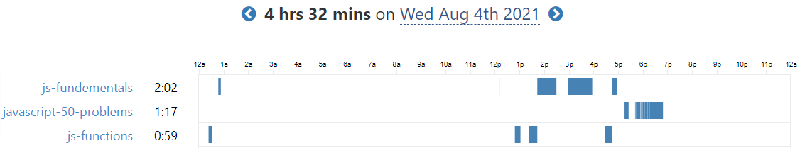
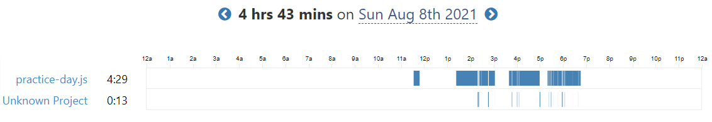

# 100 Days Of Code - Log

### Day 0: July 30, 2021

**Today's Progress**: Learn the basics _AGAIN_

**Thoughts**: Though I know basic C programming out of my curiousity, JavaScript is more liberal than this. In short, I love the syntax!

---

### Day 1: July 31, 2021

**Today's Progress**: Learn about variables declaration, data types, parseInt(), parseFloat, toFixed() method.

**Thoughts**: Wonder how easy to implement and write any pre-written method to a program. Look forward to learn more!!

---

### Day 2: August 1, 2021

**Today's Progress**:

1. Learn about array (declaration, indexOf() method index searching, charAt() push(), pop(), shift(), unshift(), splice() method).
2. Learn about conditionals (if/else statements, switch statements)
3. Basic construction of a function.

### Screenshot

_screenshot generated from [Waka Time](https://wakatime.com/). One of the best productivity tools for developers. Check this out._

**Thoughts**: When I practice the array's indexOf() method, I get confused with search by the index and by the array element. MDN Documentation helped me a lot with that topic. I find the function very interesting though.

---

### Day 3: August 2, 2021

**Today's Progress**:

1. Learn more about functions and arrays.
2. Learn about loops (while, do..while, for).
3. Solved around 15 beginner javascript problem question.

### Screenshot

_screenshot generated from [Waka Time](https://wakatime.com/). One of the best productivity tools for developers. Check this out._

**Thoughts**:
Today I solve around 15 problem questions on hackernoon. Really enjoyed these exercises. Look forward to solving more and more.

---

### Day 4: August 3, 2021

**Today's Progress**:

1. Explore objects and more functions
2. Learn how to use prompt method (user input) in node CLI

### Screenshot

_screenshot generated from [Waka Time](https://wakatime.com/). One of the best productivity tools for developers. Check this out._

**Thoughts**:
Today I discover an amazing thing which is how to take user input from node command line. Though the process is not as easy as normal browser prompt, but I enjoy this.

---

### Day 5: August 4, 2021

**Today's Progress**

1. Learn about the basics of recursive function
2. Revise everything I learn from day zero.

### Screenshot

_screenshot generated from [Waka Time](https://wakatime.com/). One of the best productivity tools for developers. Check this out._

**Thoughts**:
I find the recursion on JavaScript is a bit weird. Solved a program that finds the nth Fibonacci number using recursive function. Look forward to solving more problem questions.

---

### Day 6: August 5, 2021

**Today's Progress**

1. Learn nothing new today.
2. Have practised [Hackernoon's](https://hackernoon.com/javascript-practical-coding-challenges-for-beginners-4bq3ugr) problem questions again.

### Screenshot

_screenshot generated from [Waka Time](https://wakatime.com/). One of the best productivity tools for developers. Check this out._

**Thoughts**:
Following yesterday, today was the last revision day before starting some intermediate concepts in JavaScript. Best of luck myself.

---

### Day 7: August 6, 2021

**Today's Progress**

1. Learn the application of various Math functions, ie, Math.abs(), min(), max(), round(), ceil(), floor(), random()
2. Learn how to swap to swap variable and use of destructuring with an array.
3. Learn how to use recursion to find nth Fibonacci in a series.

### Screenshot

_screenshot generated from [Waka Time](https://wakatime.com/). One of the best productivity tools for developers. Check this out._

**Thoughts**:
I've practised more problem questions by applying what I learned today. Though, I struggled a bit in the recursion method and finding the nth Fibonacci using that method. Hope I will overcome my confusion in the following days.

---

### Day 8: August 7, 2021

**Today's Progress**

1. Learn how to use for...of loops.
2. Solved a bunch of code challenges relating to array, loops and conditions.

### Screenshot

_screenshot generated from [Waka Time](https://wakatime.com/). One of the best productivity tools for developers. Check this out._

**Thoughts**:
Today was great for me because I learned a lot of new things while solving the coding challenges. Mainly, I was able to remove my confusion in the arrays and loops, and I'm looking forward to practising the next day and revising the previous learnings once again.

---

### Day 9: August 8, 2021

**Today's Progress**

1. Today I have practised what I have learned so far and cleared up the topic that is confusing to me.

### Screenshot

_screenshot generated from [Waka Time](https://wakatime.com/). One of the best productivity tools for developers. Check this out._

**Thoughts**:
I don't know how much time should I practice coding. But I think today is enough and will look forward to the next day.
